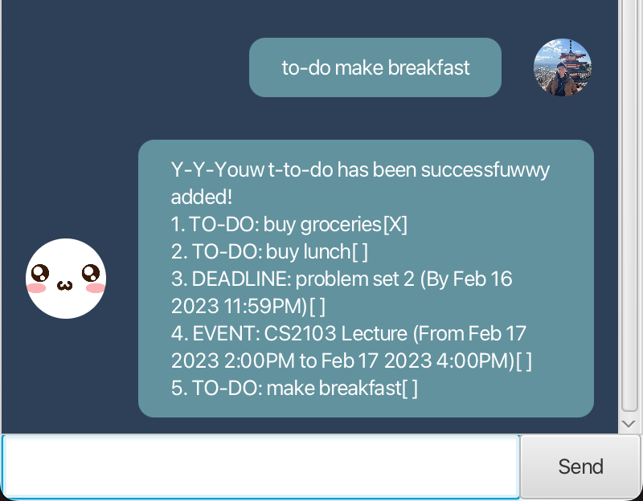
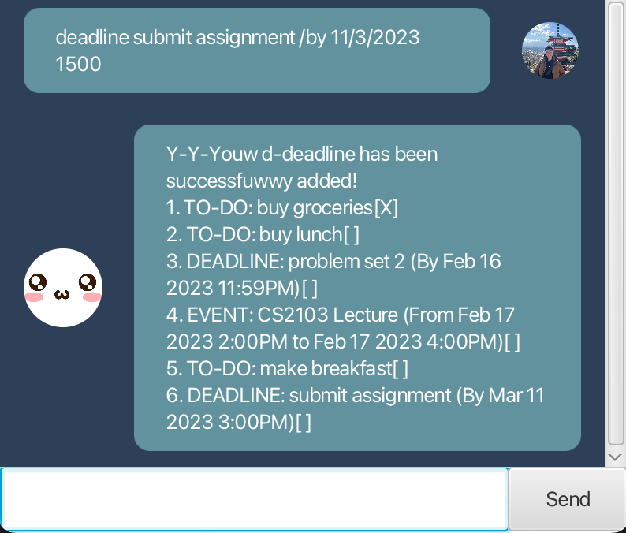
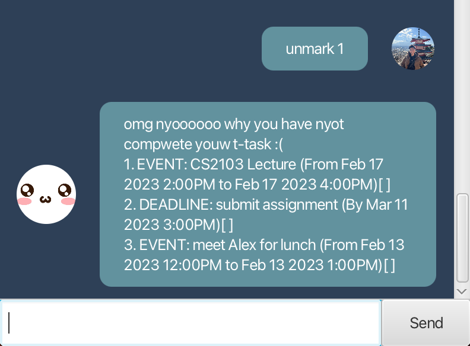
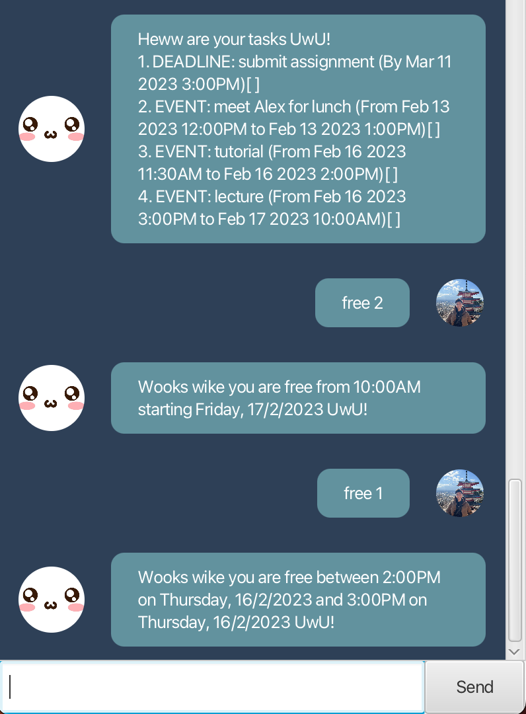

# User Guide
Ever wished you had a chat bot with a cute yet annoying personality? UwU TaskMaster is here to help!
UwU TaskMaster is a user-friendly chat bot full of UwU personality which keeps track of your to-dos, deadlines and events.

## Features

### Help
A message containing a useful list of commands and instructions in case you need any help. The help message is sent on initial start and when requested by the user via the `help` command.

### Find Free Times
This handy feature allows you to look up the nearest block of free time in your busy schedule. Simply type in `free` followed by the number of hours you require. 

For example, `free 2` prompts UwU TaskMaster to search for the nearest time interval in which you have 2 hours to spare.

### See All Tasks
You can view all the events, to-dos and deadlines by using the `list` command.

### Add New Tasks
You can add new tasks quickly by using the following commands.
1. Add a to-do: `to-do [name of to-do]`
2. Add a deadline: `deadline [name of deadline] /by [dd/mm/yyyy HH:mm]`
3. Add an event: `event [name of event] /from [dd/mm/yyyy HH:mm] /to [dd/mm/yyyy HH:mm]`

### Delete Tasks
Each task in your list has a unique index which identifies it. Tasks can be deleted by simply entering `delete` followed by the index of the task you would like to delete. 

For example, `delete 1` deletes the first task in the list.

### Search for Tasks
Have an endless list of tasks that you can't be bothered to sieve through? Simply type in `find` followed by the search keyword and UwU TaskMaster will return you the tasks with names which contain or match the keyword you search for.

For example, `find pla` will return the following filtered list of tasks from a larger list:
- DEADLINE water plants (By March 12 2023 2:00pm)[]
- TO-DO buy plates (By March 15 2023 10:00am)[]

### Data Persistence
UwU TaskMaster writes all tasks to a .txt file in your application directory under a folder called `userData`. This allows the bot to remember all your tasks on the next start up, so you do not have to worry about forgetting!

### Mark Tasks as Complete/Incomplete
You can mark tasks as completed by the command `mark` followed by the index of the task you would like to mark as completed. 

For example, `mark 3` will cause the checkbox beside the task to change from `[]` to `[X]`, indicating that the task has been marked as completed. Similarly, a task is marked as incomplete or "undone" if the `unmark` command is used instead.

## Usage
### `to-do` - Creates and adds a new to-do task
Format: `to-do [name of to-do]`
Example usage: `to-do make breakfast`

Outcome: UwU TaskMaster creates a new to-do `7. TO-DO: make breakfast[]`.

### `deadline` - Creates and adds a new deadline task
Format: `deadline [name of deadline] /by [dd/mm/yyyy HH:mm]`
Example usage: `deadline submit assignment /by 11/3/2023 1500`

Outcome: UwU TaskMaster creates a new deadline `7. DEADLINE: submit assignment (By Mar 11 2023 3:00PM)[]`.

### `event` - Creates and adds a new event task
Format: `event [name of event] /from [dd/mm/yyyy HH:mm] /to [dd/mm/yyyy HH:mm]`
Example usage: `event meet Alex for lunch /from 13/2/2023 1200 /to 13/2/2023 1300`

Outcome: UwU TaskMaster creates a new event `7. EVENT: meet Alex for lunch (From Feb 13 2023 12:00PM to Feb 13 2023 1:00PM)[]`.

### `delete` - deletes a task in the list
Format: `delete [taskNumber]`
Example usage: `delete 2`

Outcome: UwU TaskMaster deletes the task prefixed with 2.

### `mark` - Marks a task as completed
Format: `mark [taskNumber]`
Example usage: `mark 1`

Outcome: UwU TaskMaster marks the task prefixed with 1 as complete by changing the task status from `[]` to `[X]`.

### `umark` - Marks a task as incomplete
Format: `unmark [taskNumber]`
Example usage: `unmark 1`

Outcome: UwU TaskMaster marks the task prefixed with 1 as incomplete by changing the task status from `[X]` to `[]`.

### `find` - Search for tasks by keyword
Format: `find [keyword]`
Example usage: `find lecture`

Outcome: UwU TaskMaster returns a snapshot of tasks matching the keyword.

### `free` - Search for free time slots by hours
Format: `free [numberOfDesiredHours]`
Example usage: `free 2`

Outcome: UwU TaskMaster returns the closest free time slot it could find in your schedule that matches or exceeds the number of desired hours you requested.

### `bye` - End the conversation and closes the bot
Format: `bye`
Example usage: `bye`

This command causes UwU TaskMaster to exit and write new updates to the /userData/data.txt file.

> Thank *huggles tightly* you fow u-using UwU TaskMaster!  I h-hope i-it has h-h-hewped you make youw life mowe owganyised and efficient (。U ω U。)

